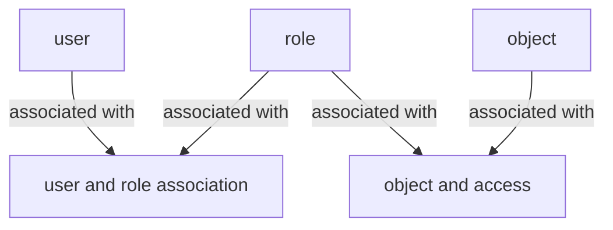
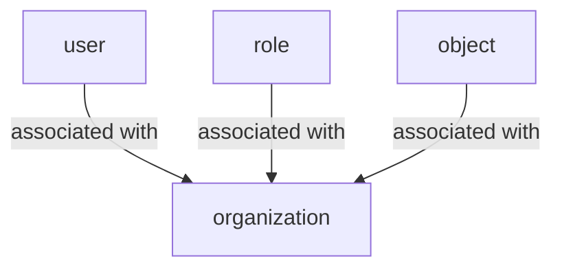
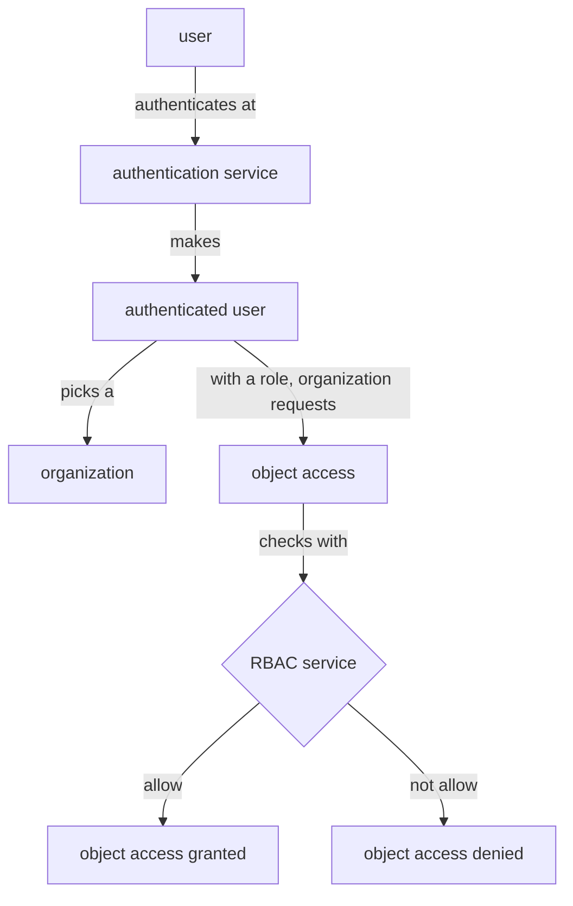

# rbac  
# Role Based Access Control (RBAC)  

Problem: Not everyone in your company should have the same level of access to all data. Sensitive information, whether it's personal employee details or confidential company data, needs to be protected with role-based permissions.  

Solution: To address the data access problem, you should implement role-based access control (RBAC). This involves defining specific roles, either within individual applications or company-wide, and assigning access permissions based on those roles. RBAC concepts and software have been well-established for over two decades, making now the opportune time to put a suitable system in place.  

For comprehensive education and expert consultation on implementing role-based access control, you can turn to DataJoin.net. DataJoin offer in-depth training to help you understand and effectively apply RBAC principles.  

https://github.com/milan888-design/rbac  

## Flowchart - Role Based Access Control setup 

## Flowchart - Users, roles and objects are by organization

  
## Flowchart  Role Based Access Control process  

  
object: webpage, report, database table, row, attribute value   